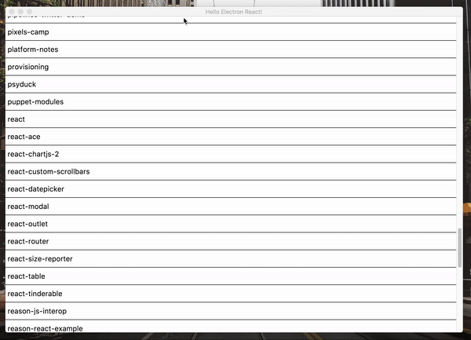

# London File Explorer

#### Disclaimer

This is just an experiment with Apollo, GraphQL, React and Electron. **I should not be using [apollo-link-state](https://github.com/apollographql/apollo-link-state/) for this**. A better idea would probably be [apollo-link-electron](https://github.com/firede/apollo-link-electron).

## About

For fun, I decided to build a file explorer with JavaScript using Electron, Apollo/GraphQL and React. The idea is that I have a GraphQL server running inside my application that resolves to the file system API. I built this as part of my talk at [React Fest](http://reactfest.uk) 2018 about GraphQL Servers running on the client.

## Todo

1. File statistics (size, last updated, owner, …)
2. Distinguish directories from files (better styling)
3. Creating files and directories (with GraphQL Mutations)

## Demo

